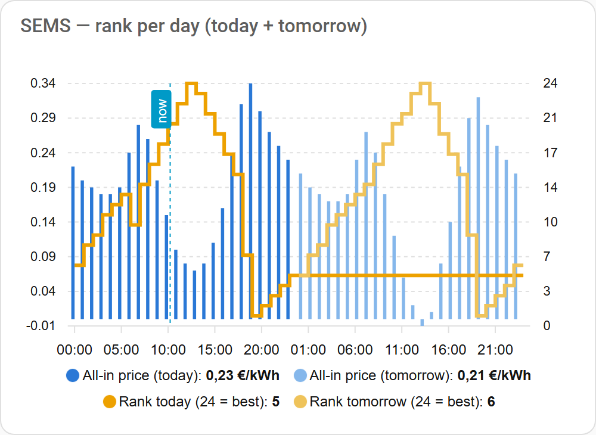
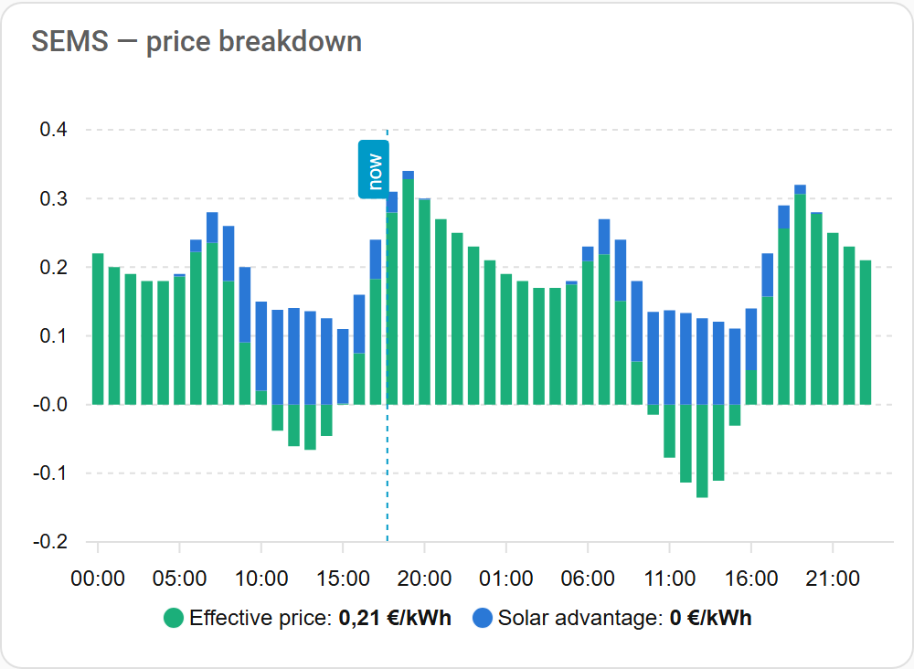
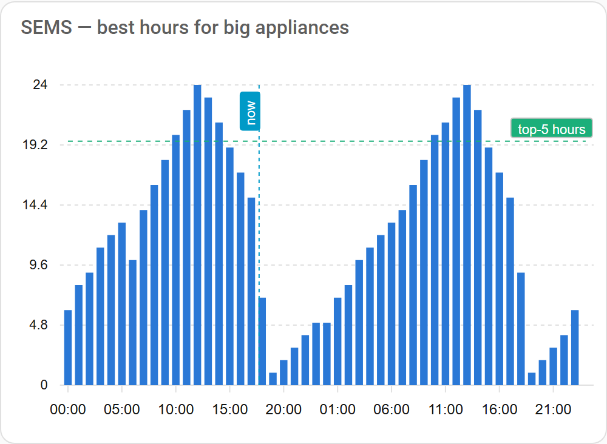

# SEMS — Simple Energy Management System

A Home Assistant integration that answers one simple question, every hour:

> **"Is this a good moment to use electricity?"**

SEMS looks at your dynamic electricity prices and your solar (PV) forecast for
the next 24 hours and turns them into a single **score per hour**. High score =
good moment to run the dishwasher, charge the car, or heat the boiler. Low
score = better to wait. You decide what matters most with one slider: price,
solar self-consumption, or a mix of both.

SEMS does **not** fetch anything from the internet. It only reads two sensors
you already have (for example Nord Pool for prices and Forecast.Solar for
solar) and does the math.

📖 **New here? The [wiki](wiki/Home.md) explains everything in plain
language** — including how the calculation works, with pictures.

## What it looks like

The all-in price, the *effective* price (what a kWh really costs you once
your solar production is counted in) and each hour's rank — for today and
tomorrow, each ranked on its own — with ready-to-paste cards from the
[Dashboard charts wiki page](wiki/Dashboard-charts.md):



Where your money actually goes, hour by hour — the blue part is what your
panels save you:



And the planner view: every column above the dashed line is a top-5 hour,
exactly when the example automations fire:



## How the score works (the short version)

For every hour in the coming 24 hours, SEMS calculates what one kWh *really
costs you*:

- In a **dark hour** you buy from the grid and pay the full all-in price
  (market price + energy tax + VAT), e.g. €0.28.
- In a **sunny hour** you use your own solar power. That power isn't free —
  you could have exported it — but exporting only earns the bare market price
  minus a feed-in fee, e.g. €0.06. So using it yourself only "costs" that
  missed €0.06.

Cheap effective hours get a high score, expensive ones a low score. The
**balance slider** (0–100) blends this price logic with a pure
"follow-the-sun" preference. Hours with a *negative* all-in price score above
100 and switch on the **free power** sensor.

The full explanation with examples: [How the score works](wiki/How-the-score-works.md).

## Installation (HACS)

1. In Home Assistant, open **HACS**.
2. Click the three dots (top right) → **Custom repositories**.
3. Add this repository's URL, category **Integration**, and click **Add**.
4. Search for **SEMS** in HACS and click **Download**.
5. Restart Home Assistant.
6. Go to **Settings → Devices & services → Add integration**, search for
   **SEMS**.

Step-by-step with screenshots: [Installation](wiki/Installation.md).

## Configuration

Setup is two screens:

1. **Source entities** — pick your electricity price sensor (required) and
   your PV forecast sensor (optional). That's the only thing you *must* do.
2. **Prices and taxes** — every field has a working default; just click
   Submit. Read on only if you want to check them.

### The `price type` choice, in plain language

Ask yourself: *does my price sensor show the price I actually pay, or the
bare market price?*

- **All-in** (default): your sensor already includes energy tax and VAT.
  This is the case for most Dutch providers' integrations (EnergyZero,
  Zonneplan, Frank Energie, ...). SEMS uses the price as-is.
- **Raw**: your sensor shows the bare market/spot price (the core Nord Pool
  integration does this). SEMS then adds your supplier markup, energy tax and
  VAT on top: `all-in = (raw + markup + tax) × (1 + VAT%)`.

> ⚠️ The default tax values are **Dutch 2026 values** (energy tax
> €0.0916/kWh excl. VAT, supplier markup €0.020/kWh, VAT 21%, export fee
> €0.02/kWh). **Verify them against your own energy contract** — they differ
> per supplier and change every year.

You can verify the conversion at any time: `sensor.sems_current_price` shows
the all-in price SEMS calculated for the current hour.

All settings can be changed later via **Settings → Devices & services →
SEMS → Configure**. Details: [Configuration](wiki/Configuration.md).

## Entities

| Entity | What it tells you |
|---|---|
| `sensor.sems_relative_score` | Current hour compared to the coming 24h: 0% = worst hour, 100% = best hour (best of the day — not "free"!). Attribute `scores_24h` holds the full 24h breakdown for graphs and automations. |
| `sensor.sems_rank` | Rank of the current hour **within today**: 1 = worst, 24 = best (stable 1–24 all day, so "rank above 19" = one of today's 5 best hours). Its `scores` attribute holds today + tomorrow (each ranked on its own) for charts and automations; `best_hour_today` / `best_hour_tomorrow` give each day's best hour. |
| `sensor.sems_current_price` | The all-in price of the current hour (to verify the tax conversion). |
| `binary_sensor.sems_free_power` | ON when the current all-in price is below the free-power threshold. |
| `binary_sensor.sems_best_2h_block` (+ 3h, 4h) | ON when the best consecutive 2/3/4-hour run starts now — for appliances that need longer than one block. Attributes show the planned start. |
| `number.sems_balance` | The 0–100 slider: 100 = only price matters, 0 = only solar self-consumption matters. |
| `sensor.sems_score` | Advanced, disabled by default: the raw internal score (0–100, above 100 = free power). |
| `sensor.sems_diagnostics` | Temporary verification sensor (debug mode): shows exactly what data SEMS found. |

More detail: [Entities](wiki/Entities.md).

## Example automations

**Start the dishwasher during the best hours** (rank 20 or higher means: one
of the 5 best hours of the coming 24):

```yaml
automation:
  - alias: "Dishwasher during a top-5 hour"
    trigger:
      - platform: numeric_state
        entity_id: sensor.sems_rank
        above: 19
    condition:
      - condition: state
        entity_id: input_boolean.dishwasher_ready  # you set this when loading it
        state: "on"
    action:
      - service: switch.turn_on
        target:
          entity_id: switch.dishwasher
```

**Turn the PV inverter off when power is free** (why export for nothing — or
even pay — when the price is negative):

```yaml
automation:
  - alias: "PV inverter off during free power"
    trigger:
      - platform: state
        entity_id: binary_sensor.sems_free_power
        to: "on"
    action:
      - service: switch.turn_off
        target:
          entity_id: switch.pv_inverter
  - alias: "PV inverter back on after free power"
    trigger:
      - platform: state
        entity_id: binary_sensor.sems_free_power
        to: "off"
    action:
      - service: switch.turn_on
        target:
          entity_id: switch.pv_inverter
```

More examples, plus ready-made ApexCharts dashboard cards:
[Example automations](wiki/Example-automations.md),
[Dashboard charts](wiki/Dashboard-charts.md) and
[Check that it works](wiki/Check-that-it-works.md).

## Good to know

- SEMS plans in **hour blocks** by default; a setting switches to
  **quarter-hour blocks** (96 per day) for suppliers with 15-minute
  prices. Hourly sources work fine in quarter mode and vice versa.
- Before ~13:00 CET, tomorrow's prices are not published yet. Those blocks
  show up as empty (`null`) in `scores_24h` — charts show a gap, nothing
  is guessed. Below 6 known hours the entities become unavailable.
- Scores are recomputed at the start of every block and whenever a source
  sensor updates.
- No external connections, no dependencies, everything runs locally.
